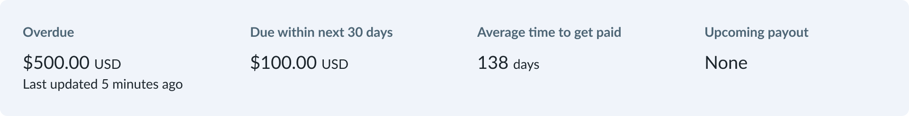

# Engineering Challenge
This is a challenge I did a few weeks ago using TypeScript. 

## Scenario
Imagine that the design team has recognized two places that use a similar UI component to provide **insights** to our users. We want to formalize this by implementing a reusable component in our design library. (Think of this component as a Lego block that can be used in multiple places.) You have been provided with the Figma file outlining the design details of this component.

## Project requirements

1. Implement the Insights component as a React component, using Typescript or Javascript.

2.  Implement styling for the Insights component using SCSS or vanilla CSS. (The project is set up to support either.)  
    a) The Figma designs use [Lato](https://fonts.google.com/share?selection.family=Lato:wght@400;700) as the font (Regular and Bold). This font is available through Google fonts.

3. Use Typescript or PropTypes to define appropriate datatypes for your component.
4. Implement the component to work **on at least one** of the following sizes as defined in the Figma file:  
    a) Wide screen sizes  
    b) Medium screen sizes  
    c) Narrow screen sizes
5. Update the [App.tsx](./src/App.tsx) file to render/use your insights component.
6. Optional: Write test(s) for your component.
We know you might be pressed for time, so we won’t consider the absence of tests as a negative. (The project is set up to use Enzyme or React Testing Library)

